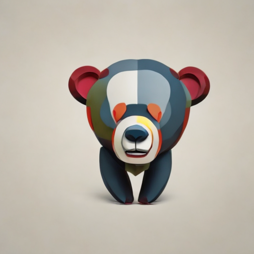
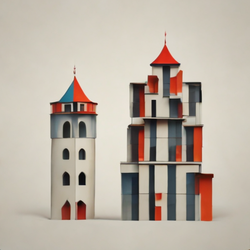
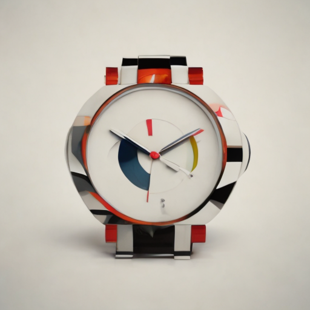
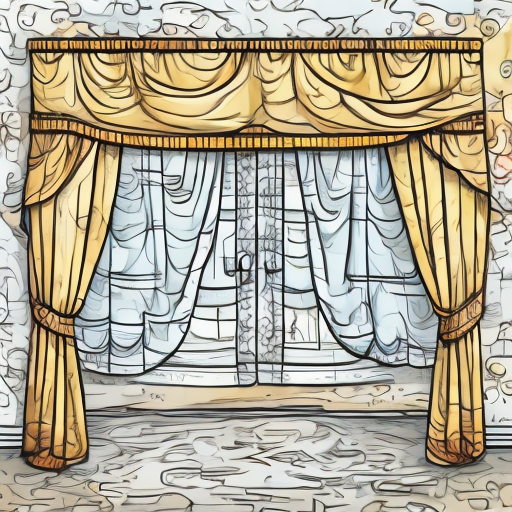
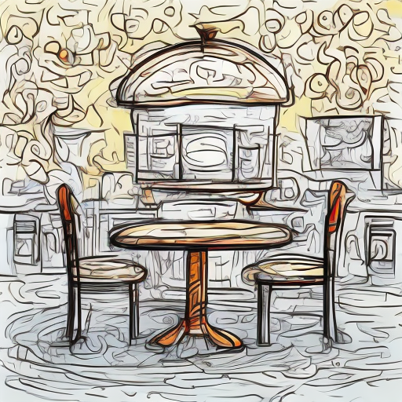
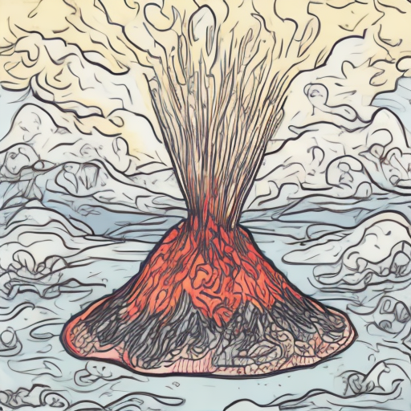
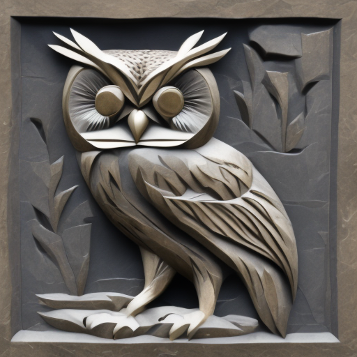
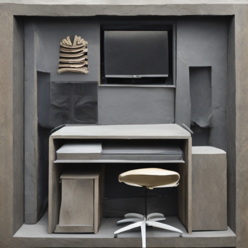

# JDiffArtFlow : 基于 Jittor 框架的少样本风格迁移图像生成框架

本项目使用 Jittor 深度学习框架与 Stable Diffusion v2.1，针对“极少样本（10-shot）”场景下的风格迁移痛点（如色调偏差、语义崩坏），实现了一套结合 DreamBooth、High-Rank LoRA、平均图推理初始化、强先验保真训练等方法的高鲁棒性轻量框架。

本项目为清华大学计算机图形学课程第二次作业项目，来自[第四届计图人工智能挑战赛](https://www.educoder.net/competitions/index/Jittor-5)-赛道二-风格迁移图片生成任务。

| 风格参考图 | 生成图1 | 生成图2 | 生成图3 |
| --------- | ------ | ------- | ------- |
 | ||
| bird | Bear | Tower | Watch |
 | ||
| balloon | Curtain | Restaurant | Volcano |
 | ||
| cat | Owl | Ship | Studio |


## 核心特色

### 优化路径

- 【训练&推理】**动态 Prompt 对齐** ：对于图片的训练和推理，均采用 `"an image of {object} in style_{id}"` 的提示词模板，希望模型将 `style_{id}` 这一特殊 Token 作为明确的“风格触发词”，更好的区分“内容”和“风格”的概念范畴。
- 【训练&推理】**优化 LoRA 配置策略**：参照 Baseline 中对 Unet 的训练方法，开启了 Text Encoder 的 LoRA 训练；探索了 Unet LoRA Rank 和 Text Encoder LoRA Rank 的配置策略，当前选择 `32` 和 `0` 的组合作为最终方案超参数，意在捕捉纹理的同时尽可能避免小数据集尚的噪声过拟合和语义漂移。
- 【推理】**平均图潜变量初始化** ：参考 [SDEdit](https://sde-image-editing.github.io/) 文章和 [pad-pad-eos](https://github.com/Chyxx/jittor-pad-pad-eos-HighQualityStyleTransfer) 比赛项目，实现自定义 `Img2ImgPipeline` 管线，支持在推理阶段使用目标训练集的“风格平均色调图”加噪初始化 Latents，大幅缓解生成图像色调漂移的问题。
- 【训练】**强先验保真训练** ：在训练前，使用原始 Stable Diffusion 根据训练和推理 Prompt 预先生成数张无风格图片；在训练时交替使用训练集风格图片 `instance_images` 和无风格图片 `class_images` 更新损失，无风格图片损失权重 `prior_loss_weight` 选择为 `1.0` ，意在通过这种“正则化”手段，利用通用图像分布约束模型参数更新方向，强制模型在学习新风格的同时，保留对通用物体结构的认知，防止生成图像物体结构崩坏。
- 【训练】**图像数据增强修复与多样化** ：修复在当前 `A` 数据集正方形图片输入下 RandomCrop 无效的问题，并增加图像翻转和旋转的数据增强方式，旨在迫使模型学习风格的内在纹理特征，而不是死记硬背物体固定形状，希望能缓解部分图像生成无法添加风格的问题。不过这种方式可能需要搭配更大的 unet/text encoder lora 和更大的训练步数，目前尚未探索出较好的组合。（当前训练还可能导致严重的“增强泄露”，模型将旋转本身也作为了风格特征，生成的图像都带有随机的旋转角度）

### 工程实现

- 为解决 Baseline 代码耦合度高、扩展性差的问题，本项目对原有参考代码进行了**全量重构与模块化封装**，从而方便魔改和调试。
- 为高效处理多种风格的并行任务，本项目提供了 `[train/infer]_all.py` 系列脚本，实现训练与推理任务的**批量化多卡并行执行**，以GPU资源为工作单元多进程分发任务，显著提升了硬件利用率与实验周转效率。
- 为方便后期调整迭代实验参数，本项目构建了 `auto_pipeline.sh` 自动化脚本，实现“训练->推理->打分->报告”的一键式全流程闭环。

项目核心目录结果如下：

```bash
.
├── configs      # yaml配置文件目录
├── data         # 训练、推理数据目录
│   ├── train
│   └── prior        # (从云盘中下载准备，或通过 scripts/gen_prior.py 生成)
├── evaluation   # eval 打分目录
│   ├── eval_score.py            # 总分计算脚本，生成报告score.txt
│   ├── jdiff_checker            # 官方提供脚本，format输出版
│   ├── requirements.txt         # <jiff_eval> conda环境需求
│   └── run_eval.py              # 细粒度分数计算脚本，jdiff_checker中的score_api.py
├── logs         # 单轮实验日志目录
├── outputs      # 单轮实验输出目录
├── scripts      # [core] 模型使用脚本目录
│   ├── auto_pipeline.sh         # 完整单轮管线脚本，训练 + 推理 + 打分
│   ├── infer_all.py             # infer 多卡多任务训练脚本
│   ├── infer_all_subprocess.py  # infer subprocess版, 旨在减少随机性 *
│   ├── train_all.py             # train 多卡多任务训练脚本
│   └── train_all_subprocess.py  # train subprocess版, 旨在减少随机性 *
├── src          # [core] 模型结构目录
│   ├── custom_pipeline.py       # Image2Image管线
│   ├── dataset.py               # DreamBoothDataset 数据准备
│   ├── models       
│   │   └── diffusion.py         # DiffusionEngine 模型准备
│   ├── run_infer.py             # 运行单个风格的推理
│   ├── run_train.py             # 运行单个风格的训练
│   ├── trainers
│   │   ├── base_trainer.py      # 基础训练类
│   │   └── dreambooth_trainer.py # dreambooth训练类，实现compte_loss方法
│   └── utils
│       ├── config.py            # 参数配置相关函数
│       └── image.py             # 图像处理相关函数
└── docker_env.sh                # docker使用快捷脚本
```

## 性能表现

实验数据集为 **第四届计图人工智能挑战赛** 赛题二 - [风格迁移图片生成](https://www.educoder.net/competitions/index/Jittor-5) - A榜数据集。包含 14 中风格，每种风格提供 10 张训练用风格图，要求以相同风格生成 25 张指定 Prompt 的风格迁移图。

评分标准： $\text{Final} = \text{Style Similarity} \times (\text{Text Consistency} + \text{Image Quality})$ 
- 风格相似度 $\text{Style Similarity} = 0.2 \cdot \text{DinoV2} + 0.4 \cdot \text{Pixel-Hist} + 0.4 \cdot (1-\text{LPIPS})$ .
- 文本一致性 $\text{Text Consistency} = 0.5 \cdot \text{CLIP R-Precision}$ .
- 图像质量 $\text{Image Quality} = 0.4 \cdot [\frac{20 - \min(\text{FID}, 20)}{20}] + 0.1 \cdot \text{CLIP-IQA}$ .

当前提交最好结果总分为 0.5121 (0.512078) ，与 Baseline 在各指标对比如下表

| Metric | Baseline | Ours | Compare |
| ------ | -------- | ---- | ------- |
| **Dino Score** (结构相似↑)     | 0.1140  | 0.1202     | +6.4%      |
| **Hist Score** (颜色相似↑)     | 0.4388  | **0.7791** | **+77.5%** |
| **FID Score** (分布距离↓)      | 1.7101  | 1.6746     | +2.1%      |
| **LPIPS Score** (感知相似↓)    | 0.5391  | **0.4287** | **+20.5%** |
| **CLIP-IQA Score** (图像质量↑) | 0.7567  | 0.7577     | +0.1%      |
| **CLIP-R Score** (文本对齐↑)   | 0.8293  | **0.9307** | **+12.2%** |
| **Final Score** (最终总分)     | 0.3274  | **0.5121** | **+56.4%** |

## 快速开始

本项目实验在 Ubuntu 22.04 服务器 + 4 张 NVIDIA GeForce RTX 4090 (24GB VRAM) 环境下完成，脚本配置使用 `1,2,3` 号卡，可根据实际环境在 `[train/infer]_all.py` 中调整 `active_gpus` 列表；软件方面依赖为 Docker 和 Conda。

实验实际上可在单张 4090 上运行，且当前配置参数下训练显存占用仅 `50%` ，余量很大。

### 环境准备

训练与推理环境：按照 `docs/assignments.pdf` 说明进行，请使用 Docker 环境以支持 `auto_pipeline.sh` 的使用。Docker 配置过程记录可参见 [`docs/note.md`](./docs/note.md) .

```bash
docker import jdiffusion.tar jdiffusion:latest  # 完成容器快照导入
./docker_env.sh start # 创建名为 jdiff_work 的容器
./docker_env.sh enter # 进入容器，脚本已实现进入即开启 jdiffusion 的 conda 环境并进入 workspace 项目根目录
# 完成如文档中所述环境修正：实际上仅需要如下操作
# cd JDiffusion & pip install -e .
# pip uninstall jittor
# pip install git+https://github.com/JittorRepos/jittor
# 然后是 DreamBooth LoRA Baseline 需求库
# pip install accelerate==0.27.2
# pip install peft==0.10.0
# TODO: 提供更新好的 docker 容器快照
exit # 回到host环境
```

评分环境：使用 Host 端 conda 环境

```bash
conda create -n jdiff_eval python=3.9 -y
conda activate jdiff_eval
pip install -r evaluation/requirements.txt
```

### 数据准备

详见 `data/README.md`

1. 准备数据集：数据集已放置于 `data` 目录中，也可自行下载；
2. 准备Prior无风格图片集：可自行生成； 可从 [云盘](https://cloud.tsinghua.edu.cn/d/6bac317eada140408f9a/) 获取项目训练时所用数据

### 框架运行

在任意环境使用自动化脚本一键运行全流程（训练 + 推理 + 评分）

```bash
bash scripts/auto_pipeline.sh 15 
# 数字 n 代表对前 n 种风格数量执行流程，默认为 15 即全部
```

或在对应环境下分别执行核心脚本，可从 `auto_pipeline.sh` 脚本查看各流程环境和核心操作脚本。

输出位于 `outputs` 目录，日志位于 `logs` 目录。

## 现存问题

#### 欠风格化

现有每种风格的模型生成中，都存在个别风格严重缺失的图片。推测为 **待生成物体语义** 与 **风格语义** 间存在巨大鸿沟，导致模型在 UNet 的潜在空间中无法找到合理的映射路径，便倾向于直接生成写实照片。典型例子： `style_00` 梵高风格下，现代工业产品如 Aquarium, Phone, Wallet 生成时出现风格抵抗现象。图像的总体质量肉眼仍相当容易看出不足。

期待通过 [Style Injection](https://openaccess.thecvf.com/content/CVPR2024/papers/Chung_Style_Injection_in_Diffusion_A_Training-free_Approach_for_Adapting_Large-scale_CVPR_2024_paper.pdf) 文章提出的推理端注意力注入方案解决；或通过扩大 LoRA 规模和数据增强，增强模型对风格的理解和泛化能力

#### 流程随机性不可控

尽管本项目在数据加载层面实现了严格的种子固定与排序逻辑，并在多卡并发训练和推理中使用 subprocess 进程隔离，强制为每个风格任务重置内存与 CUDA 上下文以杜绝任务间的状态污染与条件依赖，但仍无法彻底消除结果的随机性（即修改无关代码逻辑，或者同时进行不同数量的风格训练推理，最终单模型得分数会出现小幅波动）。

## 参考资料

参考比赛项目

- [Chyxx/jittor-pad-pad-eos-HighQualityStyleTransfer](https://github.com/Chyxx/jittor-pad-pad-eos-HighQualityStyleTransfer)
- [lee12332/StyleBooth](https://github.com/lee12332/StyleBooth)
- [czpcf/jittor-5-b](https://github.com/czpcf/jittor-5-b)

参考文献

```
@inproceedings{ruiz2023dreambooth,
  title={Dreambooth: Fine tuning text-to-image diffusion models for subject-driven generation},
  author={Ruiz, Nataniel and Li, Yuanzhen and Jampani, Varun and Pritch, Yael and Rubinstein, Michael and Aberman, Kfir},
  booktitle={Proceedings of the IEEE/CVF Conference on Computer Vision and Pattern Recognition},
  year={2023}
}

@inproceedings{
    meng2022sdedit,
    title={{SDE}dit: Guided Image Synthesis and Editing with Stochastic Differential Equations},
    author={Chenlin Meng and Yutong He and Yang Song and Jiaming Song and Jiajun Wu and Jun-Yan Zhu and Stefano Ermon},
    booktitle={International Conference on Learning Representations},
    year={2022},
}

@InProceedings{Chung_2024_CVPR,
    author    = {Chung, Jiwoo and Hyun, Sangeek and Heo, Jae-Pil},
    title     = {Style Injection in Diffusion: A Training-free Approach for Adapting Large-scale Diffusion Models for Style Transfer},
    booktitle = {Proceedings of the IEEE/CVF Conference on Computer Vision and Pattern Recognition (CVPR)},
    month     = {June},
    year      = {2024},
    pages     = {8795-8805}
}

```