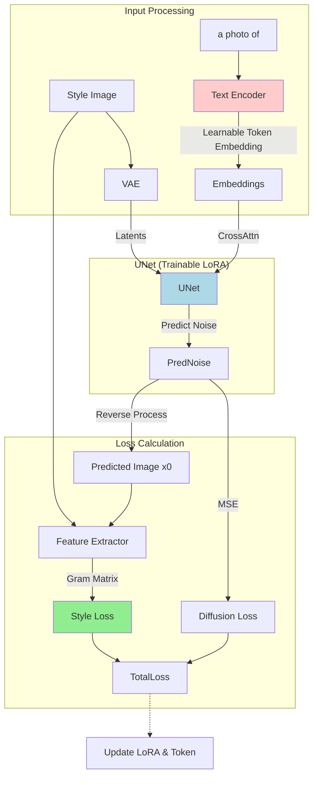

## 从0开始环境配置

替换失效torch链接
```bash
pip install torch==2.0.0 torchvision --index-url https://download.pytorch.org/whl/cpu
```

之后会有各种细节报错，要各种调整代码，感觉不太对；用提供的Docker就没问题


## Docker环境配置


```bash
sudo apt install -y ca-certificates curl gnupg

sudo install -m 0755 -d /etc/apt/keyrings
curl -fsSL https://mirrors.tuna.tsinghua.edu.cn/docker-ce/linux/ubuntu/gpg | sudo gpg --dearmor -o /etc/apt/keyrings/docker.gpg
sudo chmod a+r /etc/apt/keyrings/docker.gpg
echo "deb [arch=$(dpkg --print-architecture) signed-by=/etc/apt/keyrings/docker.gpg] https://mirrors.tuna.tsinghua.edu.cn/docker-ce/linux/ubuntu \
  $(. /etc/os-release && echo "$VERSION_CODENAME") stable" | \
  sudo tee /etc/apt/sources.list.d/docker.list > /dev/null

sudo apt update
sudo apt install -y docker-ce docker-ce-cli containerd.io docker-buildx-plugin docker-compose-plugin
```

Docker镜像源配置
```bash
sudo vim /etc/docker/daemon.json

# 内容为
{
  "registry-mirrors": [
    "https://docker.m.daocloud.io",
    "https://huecker.io",
    "https://dockerhub.timeweb.cloud",
    "https://noohub.ru"
  ]
}
# == 结束

sudo systemctl daemon-reload
sudo systemctl restart docker
```

测试 `sudo docker run --rm hello-world`

免sudo
```bash
sudo usermod -aG docker $USER
newgrp docker
# 注意 vscode 的话需要杀死服务器上的 vscode 进程， Ctrl + Shift + P 选择 Kill VS Code Server on Host 然后重连
# 或直接 pkill -f vscode=server
```

NVIDIA 显卡支持 (NVIDIA Container Toolkit)
```bash
curl -fsSL https://nvidia.github.io/libnvidia-container/gpgkey | sudo gpg --dearmor -o /usr/share/keyrings/nvidia-container-toolkit-keyring.gpg \
  && curl -s -L https://nvidia.github.io/libnvidia-container/stable/deb/nvidia-container-toolkit.list | \
    sed 's#deb https://#deb [signed-by=/usr/share/keyrings/nvidia-container-toolkit-keyring.gpg] https://#g' | \
    sudo tee /etc/apt/sources.list.d/nvidia-container-toolkit.list
sudo apt update
sudo apt install -y nvidia-container-toolkit
sudo nvidia-ctk runtime configure --runtime=docker
sudo systemctl restart docker
```

装入环境
```bash
docker import jdiffusion.tar jdiffusion:latest
```

修复Cgroup V2 兼容性问题
```bash
sudo nano /etc/nvidia-container-runtime/config.toml
# 配置 no-cgroups = true
sudo systemctl restart docker
```

启动
```bash
###### -it
docker run --gpus all -it jdiffusion:latest /bin/bash
# 退出
exit

###### -dt
docker run -dt --gpus all --name jdiff_work -v "$(pwd):/workspace" jdiffusion:latest /bin/bash
docker ps
docker exec -d jdiff_work bash -c "python train.py > log.txt 2>&1"

docker stop jdiff_work # 停机
docker start jdiff_work # 启动

# 进入容器
docker exec -it jdiff_work /bin/bash
exit # 退出容器 或 Ctrl + D
```


容器内下载代码
```bash
git clone https://gitclone.com/github.com/JittorRepos/JDiffusion.git
# 插入 gitclone.com 使用国内镜像站
# 但还是好慢，不用了，直接容器外clone就好
```

jdiffusion容器内的环境操作
```bash
conda activate jdiffusion

# 1. 使用新的JDiffusion
cd xxx/JDiffusion
pip install -e .

# 2. 更新jittor (原因在于cutlass地址更新)
pip uninstall -y jittor
rm -rf /root/.cache/jittor
pip install git+https://github.com/JittorRepos/jittor
```

权限覆盖问题：Docker内操纵挂载的内容产生的权限root高于宿主机用户
```bash
# 到没权限的目录处，如 JDiffusion
sudo chown -R $USER:$USER .
```

解决Hugging Face访问网络问题
```bash
export HF_ENDPOINT=https://hf-mirror.com
```

## 测评环境

docker外宿主机上新建环境

```bash
conda create -n jdiff_eval python=3.9 -y
conda activate jdiff_eval
pip install -r requirements.txt
```

运行测评
```bash
python score_api.py \
  --upload_path ../../JDiffusion/examples/dreambooth/output \
  --result_path ../../outputs/scores
```

## Model

